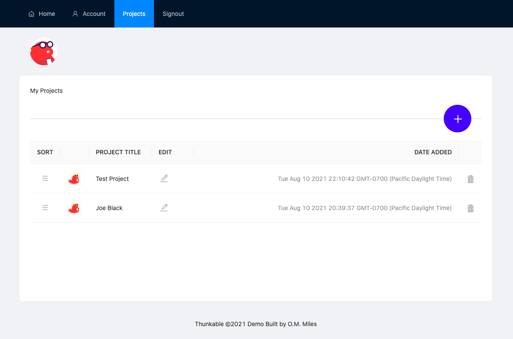

# Ant Design Project Dashboard

## Table of Contents
1. [General Info](#general-info)
2. [Technologies](#technologies)
3. [Installation](#installation)
4. [Collaboration](#collaboration)

## General Info
***
This repo is a projects dashboard, similar to simplified version of Asana.  Users can drag, sort and re-organize projects, as well as add, edit, and delete projects.  Please visit the live Heroku demo to the left or clone the project to play around with the code yourself!
This repo is a projects dashboard, similar to simplified version of Asana.  Users can drag, sort and re-organize projects, as well as add, edit, and delete projects.  Please visit the live Heroku demo to the left or clone the project to play around with the code yourself!
### Screenshot:



## Technologies
***
Write down general information about your project.

* ANTD: Version 4.16.11
* Array Move: Version ^3.0.1
* React: Version 17.0.2
* React DOM: Version 17.0.2
* React Redux: Version 7.2.4
* React Scripts: 4.0.3
* React Sortable Hoc: Version 2.0.0
* Redux Thunk: Version 2.3.0

## Installation
***
1. Use HTTPS(below), SSH, or GitHub CLI to clone this repo.

```
$ git clone https://github.com/ommiles/fisher-yates-shuffle.git
$ cd ../path/to/the/file
```

2. Install all required dependencies, execute the database migration, and start the Rails server locally:

```
$ bundle install
$ rake db:migrate
$ rails s to start
```

3. Install the project's node packages and start the frontend server:

```
$ npm install
$ npm start
``` 

## Collaboration
***
Please let me know if you spot areas of improvement or ripe for refactoring.  I love to learn and appreciate constructive feedback!

> Contact me at:
> https://ommiles.com/
